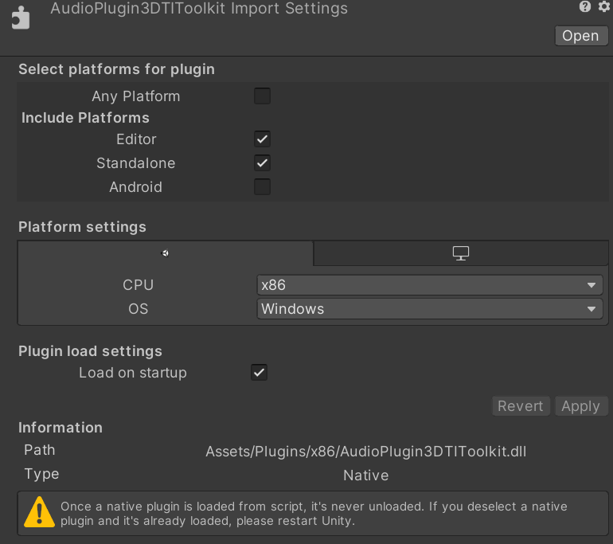

# Unity Wrapper for 3D-Tune-In Toolkit

This is the README file for the 3D-Tune-In Toolkit Unity Wrapper. 
If this is the first time you use the wrapper, please read the quick start guide.
After that, if you want to develop your own apps using the wrapper, please read the reference manual.

**The structure of the repository is as follows:**
```
3dti_UnityWrapper
├── 3dti_AudioToolkit -> Submodule of the 3DTI toolkit*
├── Binaural
    ├── 3DTI_Toolkit_Modules -> 3rd party libraries used to build the native code
    ├── BuildUnityWrapperPackage -> Unity project to build the package
    └── audioplugin3DTIToolkit -> Native C++ code and IDE projects to build
```
## Introduction

The 3D-Tune-In Toolkit (3DTI Toolkit) consists in a set of C++ libraries and resources providing solutions for 3D audio spatialization and simulation of hearing loss and hearing aids. All the documentation about the library and the code is available at:

https://github.com/3DTune-In/3dti_AudioToolkit.

Technical details about the 3D Tune-In Toolkit spatialiser are described in:

Cuevas-Rodríguez M, Picinali L, González-Toledo D, Garre C, de la Rubia-Cuestas E, Molina-Tanco L and Reyes-Lecuona A. (2019) 3D Tune-In Toolkit: An open-source library for real-time binaural spatialisation. PLOS ONE 14(3): e0211899. https://doi.org/10.1371/journal.pone.0211899

**The Unity Wrapper** of the 3DTi Toolkit (3DTI Unity Wrapper) allows integration of some of these components of the Toolkit in any Unity Scene. These components are packed in the form of a Unity Package requiring Unity 2019.4 or above. This wrapper includes 3DTi toolkit version M20191205.

The current version of the package is built to support the following platforms:

- As Host: Microsoft Windows 10, MacOS (Intel).
- As Target: Microsoft Windows x64, MacOS (Intel), Android x64 (4.4 or above), iOS. (We also include binaries for Windows x86 but they are not tested on a 32 bit computer so are not officially supported.)

In its current version, the following parts of the 3DTI Toolkit are made available to a Unity application:

- Binaural anechoic spatializer including reverb simulation
- Hearing loss simulation
- Hearing aid simulation

## Usage instructions

The toolkit is distributed as a Unity package. It should be imported into your Unity project using the menu command *Assets > Import Package > Custom Package...*

### Binaural spatializer

To use the spatializer in your project, the *Spatializer* component (defined in the *API_3DTI* namespace) should be added to your scene. We recommend adding it to your _Main Camera_ object so it is present in your scene throughout. Next, go to *Edit > Project Settings*. In the Project Settings, under *Audio* choose *3DTI Binaural Spatializer* for the *Spatializer* option.

This should be enough for the spatializer to work on standard Unity audio sources with its default settings.

In the Inspector, the *API_3DTI_Spatializer* component provides further options, including menus to select the binary resources being used such as the different Head-related Transfer Functions (HRTFs) that are included within the package.

For further information about these additional options, please refer to the 3DTI Toolkit documentation.

The Spatializer has a number of parameters, which may be set in the Unity inspector. These parameter may also be set and read from scripts by using the SetParameter<T> and GetParameter<T> methods. In these generic methods, `T` refers to the parameter's type (e.g. `float` or `bool`) and the first parameter is a value of the `Spatializer.Parameter` enum. Documentation of each parameter, including each type, is provided by attributes within the definition of the `Parameter` enum in `Spatializer.cs`.

For example, get and set the head radius like this:

```cs
spatializer.setParameter(API_3DTI.Spatializer.Parameter.HeadRadius, 0.0875);
float headRadiusM = spatializer.getParameter<float>(API_3DTI.Spatializer.Parameter.HeadRadius);
```


Some parameters may have a different value for each source. Others are global for all sources. The Inspector GUI allows you to set default values for the per-source parameters. To specify different values for each source, you can pass the source as an argument to `SetParameter` or `GetParameter`. Note that this is only valid on per-source parameters, which are marked in the Parameter attributes with `isSourceParameter`.

To set a binary resource from code, such as an HRTF or a BRIR, use the `SetBinaryResourcePath` method.


### Binaural reverb

Binaural reverb is implemented as part of the Spatializer and can be enabled on the component's inspector. However, to receive the reverb mix you additionally need to add the 3DTI Spatializer Core audio effect to your mixer strip, so the plugin can return the mixed reverb.

### Hearing Aid and Hearing Loss simulators

Hearing Aid (HA) and Hearing Loss (HL) are implemented as standard Unity native audio plugins. These are found on the mixer in the Audio window of your project. In order to use them, you also need to add the relevant components *API_3DTI_HL* and *API_3DTI_HA* to your project. Note that HA depends on HL so if you want to use HA you need to add the HL component as well. You can add these components anywhere to your hierarchy but they must be present at the moment the scene starts so we recommend also adding them to your _Main Camera_ object. 

Unlike the Spatializer, the controls for HA and HL can be found on the mixer strip where the plugins have been added. Select the strip to reveal the controls in the inspector.

For setting parameters from code, Version 3.0 of the wrapper introduces a new API, but currently it is implemented for HL and not HA. HA will be upgraded to the new API in a future update.

In the new API, each parameter can be read or set by calling `GetParameter<T>` and `SetParameter<T>` on the API_3DTI_HL component. As with the spatializer, the parameters are defined by an enum in the API_3DTI_HL class, with further information provided by the attribute for each defined parameter.

Most HL parameters may be set on either ear independently. We use the same Parameter enum value for either ear and indicate which ears to apply it to with the `T_ear` enum which is an additional parameter passed to `GetParameter<T>` and `SetParameter<T>`.

HA parameters are currently still using the old API, with individual methods for the different parameters. See `API-3DTI_HA.cs` for details. Please note these methods will be replaced with `Parameter` enums in a future update.

HA and HL use Unity's audio plugin parameter API, which means their values may be snapshotted in the mixer. However, to support this while also offering C# methods to set the parameters, we need the mixer to have all the parameters exposed. Therefore, for HA and HL you must use the provided 3DTI_HAHL_Mixer that is included within the package, otherwise the C# interface will not work. This is a quirk of Unity's Audio Plugin API.


### Notes on using within an iOS app

The package includes binary files for the four supported end platforms (MacOS, iOS, Android, Windows). These files should be automatically set to be bundled with the appropriate builds when imported but you can double check this by finding the relevant binary files in the Project file browser under *Assets/Plugins/* and then finding the subfolder referring to your platform (*x86* is Windows 32 bit, *x86_64* is Windows 64 bit). Somewhere within each of these subfolders is the single file that is the plugin binary for this platform. If you click on the binary file while Unity is set to build for that platform then you should see in the inspector checkboxes corresponding to the appropriate platforms.



In our testing, we have found one quirk when combining the toolkit in a Unity VR application on iOS that depends on `libvrunity.a`. There appears to be a conflict between two possible audio engines that can cause no audio to appear on the iOS application. This can be fixed within your app's Xcode project which is automatically created by Unity as part of the process of building for iOS. In the project settings under the tab *Build Phases* you should see *libaudioplugin3DTIToolkit.a* (our binary file) but also *libvrunity.a* (part of Unity's VR system). If you do then you need to ensure the files are ordered so that *libaudioplugin3DTIToolkit.a* appears before *libvrunity.a* on this list.

## Build instructions

The reposity includes the binaries for each platform ready built so it is not necessary to build them yourself.

Each platform contains a separate IDE project to build the native binary files for the toolkit under the *Binaural/audioplugin3DTIToolkit* folder. For MacOS and iOS this is an Xcode project desigend to run on MacOS. For Windows and Android it is a Visual Studio solution. These projects refer to a common C++ codebase within the *src* subfolder, as well as the toolkit code from the 3dti_AudioToolkit submodule.

Each project will output the binary plugin for its own platform. These binaries should be copied into the appropriate location within the *BuildUnityWrapperPackage/Assets/Plugins* folder.

Once all of the binaries are updated, you can then export the BuildUnityWrapperPackage project by opening it in Unity and choosing from the menu *Assets > Export package*.

## Known issues

The Baer-Moore frequency smearing algorithm on the Hearing Loss simulation incurs a significant overhead when a scene launches due to the calculation of internal coefficients. On Android, we've observed this can greatly delay the launch of a scene. To avoid this, we've set the default smearing method to Graf instead of Baer-Moore. Furthermore, if you are not using the Hearing Loss or Hearing Aid simluations then we recommend removing these plugins from the 3DTI_HAHL_Mixer strip, or removing the mixer strip from your project.


## Credits

This software was developed by a team coordinated by 
-	Arcadio Reyes-Lecuona ([University of Malaga](https://www.uma.es/)). Contact: areyes@uma.es  
-	Lorenzo Picinali ([Imperial College London](https://www.imperial.ac.uk/)). Contact: l.picinali@imperial.ac.uk 

The members of the development team of the version 1.x are (in alphabetical order):

- [Maria Cuevas-Rodriguez](https://github.com/mariacuevas) (University of Malaga) 
- [Carlos Garre](https://github.com/carlosgarre) (University of Malaga) (Left the team Jan 2018)
- [Daniel Gonzalez-Toledo](https://github.com/dgonzalezt) (University of Malaga) 
- [Luis Molina-Tanco](https://github.com/lmtanco) (University of Malaga)
- [Ángel Rodríguez-Rivero](https://github.com/ardgzrivero) (University of Malaga) (Joined the team Feb 2018 to Jul 2019)


The developer of the version 2.0 and 3.0 is:

- [Tim Murray-Browne](https://github.com/timmb) (Imperial College London)

## Acknowledgements 

 This project has received funding from the European Union’s Horizon 2020 research and innovation programme under grant agreement No 644051. 

We would like to acknowledge Dr. Brian FG Katz and his team for their contributions in the field of sound spatialization, which were used as the basis for part of this software.
